# SpecFactory — Component AI Validation Architecture

> **Complete system reference for Component Discovery, Tiered Resolution, and AI-Powered Validation**
>
> Last updated: 2026-02-16 | Status: Production-ready

---

## Table of Contents

1. [Executive Summary](#1-executive-summary)
2. [System Overview — High-Level Flow](#2-system-overview)
3. [Data Structures & File Layout](#3-data-structures--file-layout)
4. [Component Database (Source of Truth)](#4-component-database)
5. [Field Rules — Match, AI & Priority Configuration](#5-field-rules-configuration)
6. [Runtime Resolution Engine (Tier 1 — Fast Path)](#6-runtime-resolution-engine)
7. [Property-Aware Scoring with Variance Policies](#7-property-aware-scoring)
8. [Identity Observations & Review Queue](#8-identity-observations--review-queue)
9. [AI Batch Validation (Tier 2 — Thinking Model)](#9-ai-batch-validation)
10. [Human Review (Tier 3 — GUI)](#10-human-review-gui)
11. [Override Layering & Cache Invalidation](#11-override-layering)
12. [Studio Configuration UI](#12-studio-configuration-ui)
13. [API Endpoints](#13-api-endpoints)
14. [Complete Scenario Walkthroughs](#14-scenario-walkthroughs)
15. [Gap Analysis & Known Limitations](#15-gap-analysis)
16. [File Reference Index](#16-file-reference-index)

---

## 1. Executive Summary

Components (sensors, switches, encoders, materials) are **shared entities** referenced by many products. When the extraction pipeline processes a product and encounters a `component_ref` field (e.g., "sensor"), it must resolve the raw extracted string (e.g., "PMW3390") to either:

- An **existing component** in the component database, or
- Flag it as a **genuinely new component** requiring review

### The Problem

String similarity alone cannot distinguish "PMW3390 is just a typo for PMW3389" from "PMW3390 is a genuinely different sensor with different DPI/IPS specifications." Only reasoning over **properties + evidence + variance rules** can make that call reliably.

### The Solution — Three-Tier Resolution

```mermaid
graph TD
    A["Raw Extracted Value<br/><i>e.g. 'PMW3390'</i>"] --> B{Exact Match?<br/>Name or Alias}
    B -->|Yes| C["✅ Auto-Accept<br/>Record Identity Observation"]
    B -->|No| D["Property-Aware<br/>Fuzzy Scoring"]
    D --> E{Combined Score<br/>≥ auto_accept?}
    E -->|"≥ 0.95"| F["✅ Auto-Accept<br/>Record Identity Observation"]
    E -->|No| G{Combined Score<br/>≥ flag_review?}
    G -->|"≥ 0.65"| H["⚠️ Use Provisionally<br/>Flag for AI Review"]
    G -->|"< 0.65"| I{allow_new_components?}
    I -->|Yes| J["🆕 Flag as New Component<br/>Pending AI Review"]
    I -->|No| K["❌ Normalize as text<br/>No component match"]

    H --> L["AI Batch Validation<br/><i>Thinking Model</i>"]
    J --> L
    L --> M{AI Decision}
    M -->|same_component| N["Add Alias → Override File<br/>Status: accepted_alias"]
    M -->|new_component| O["Flag for Human Review<br/>Status: pending_human"]
    M -->|reject| P["Mark Rejected<br/>Status: rejected_ai"]

    O --> Q["Human Review Panel"]
    Q --> R{Human Decision}
    R -->|Approve New| S["Status: approved_new"]
    R -->|Merge as Alias| T["Write Alias Override<br/>Status: accepted_alias"]
    R -->|Dismiss| U["Status: dismissed"]

    style C fill:#22c55e,color:#fff
    style F fill:#22c55e,color:#fff
    style H fill:#eab308,color:#000
    style J fill:#3b82f6,color:#fff
    style N fill:#22c55e,color:#fff
    style O fill:#f97316,color:#fff
    style P fill:#ef4444,color:#fff
    style S fill:#3b82f6,color:#fff
    style T fill:#22c55e,color:#fff
    style U fill:#6b7280,color:#fff
```



---

## 2. System Overview

### End-to-End Data Flow


### Module Dependency Graph


---

## 3. Data Structures & File Layout

### Directory Structure

```
helper_files/{category}/
├── _generated/
│   ├── component_db/
│   │   ├── sensors.json          # Compiled from Excel workbook
│   │   ├── switches.json
│   │   ├── encoders.json
│   │   └── materials.json
│   ├── field_rules.json          # Compiled rules with match/ai/priority
│   └── known_values.json
├── _overrides/
│   └── components/
│       ├── sensor_pmw3389.json   # Per-component override (aliases, properties)
│       ├── sensor_hero-2.json
│       └── switch_omron-d2fc.json
├── _suggestions/
│   ├── component_review.json     # Flagged items for AI/human review
│   └── component_identity.json   # Successful match observations
└── field_rules_draft.json        # User-authored rules (Studio output)
```

### Component DB Entry (sensors.json)

```json
{
  "category": "mouse",
  "component_type": "sensor",
  "generated_at": "2026-02-15T19:54:06.637Z",
  "items": [
    {
      "name": "Focus Pro 45K",
      "maker": "razer",
      "aliases": ["FocusPro45K"],
      "links": ["https://razer.com/focus-pro-45k"],
      "properties": {
        "dpi": 45000,
        "ips": 900,
        "acceleration": 85,
        "sensor_type": "optical"
      },
      "__variance_policies": {
        "dpi": "upper_bound",
        "ips": "upper_bound",
        "acceleration": "upper_bound"
      },
      "__constraints": {
        "sensor_date": ["sensor_date <= release_date"]
      }
    }
  ]
}
```

### Component Override File (sensor_focus-pro-45k.json)

```json
{
  "componentType": "sensor",
  "name": "Focus Pro 45K",
  "properties": {
    "dpi": 45000
  },
  "identity": {
    "name": "Focus Pro 45K",
    "maker": "Razer",
    "aliases": ["FocusPro45K", "Focus Pro 45000"]
  },
  "updated_at": "2026-02-16T10:30:00.000Z"
}
```

### Component Review Item (component_review.json)

```json
{
  "version": 1,
  "category": "mouse",
  "items": [
    {
      "review_id": "cr_sensor_pmw3390_product123",
      "component_type": "sensor",
      "field_key": "sensor",
      "raw_query": "PMW3390",
      "matched_component": "PMW3389",
      "match_type": "fuzzy_flagged",
      "name_score": 0.87,
      "property_score": 0.6,
      "combined_score": 0.71,
      "alternatives": [
        { "canonical_name": "PMW3389", "score": 0.87 },
        { "canonical_name": "PMW3360", "score": 0.72 }
      ],
      "product_id": "mouse-razer-viper-v3",
      "run_id": "run_20260216_001",
      "status": "pending_ai",
      "created_at": "2026-02-16T09:00:00.000Z"
    }
  ],
  "updated_at": "2026-02-16T09:00:00.000Z"
}
```

### Identity Observation (component_identity.json)

```json
{
  "version": 1,
  "category": "mouse",
  "observations": [
    {
      "component_type": "sensor",
      "canonical_name": "Focus Pro 45K",
      "raw_query": "Focus Pro 45K",
      "match_type": "exact_or_alias",
      "score": 1.0,
      "field_key": "sensor",
      "product_id": "mouse-razer-deathadder-v3",
      "run_id": "run_20260215_005",
      "observed_at": "2026-02-15T14:30:00.000Z"
    }
  ],
  "updated_at": "2026-02-15T14:30:00.000Z"
}
```

### Review Status State Machine


---

## 4. Component Database

### How Component DBs are Built


### Property Mappings (from field_rules_draft.json)

Each component_source defines property_mappings that control how values are read, typed, and constrained:

```json
{
  "component_sources": [{
    "sheet": "Sensors",
    "component_type": "sensor",
    "roles": {
      "primary_identifier": "A",
      "maker": "B",
      "aliases": ["C"],
      "properties": [
        { "key": "dpi", "column": "D", "type": "number", "unit": "", "variance_policy": "upper_bound" },
        { "key": "ips", "column": "E", "type": "number", "unit": "", "variance_policy": "upper_bound" },
        { "key": "acceleration", "column": "F", "type": "number", "unit": "g", "variance_policy": "upper_bound" },
        { "key": "sensor_type", "column": "G", "type": "string", "variance_policy": "authoritative" },
        { "key": "sensor_date", "column": "H", "type": "number", "constraints": ["sensor_date <= release_date"] }
      ]
    }
  }]
}
```

### Override Layering Order


The `field-rules/loader.js` merges overrides on top of the generated DB at load time:
1. Properties from overrides replace generated properties
2. Identity overrides (name, maker, aliases) replace generated identity
3. New aliases are appended (not duplicated)

---

## 5. Field Rules Configuration

### Component Rule Block in field_rules_draft.json

```json
{
  "fields": {
    "sensor": {
      "type": "component_ref",
      "component": {
        "type": "sensor",
        "source": "component_db.sensor",
        "allow_new_components": true,
        "require_identity_evidence": true,
        "match": {
          "fuzzy_threshold": 0.75,
          "property_weight": 0.6,
          "name_weight": 0.4,
          "property_keys": ["dpi", "ips", "acceleration", "sensor_type"],
          "auto_accept_score": 0.95,
          "flag_review_score": 0.65
        },
        "ai": {
          "mode": "judge",
          "model_strategy": "force_deep",
          "context_level": "properties_and_evidence",
          "reasoning_note": "Sensor variants often differ by 1 digit but have different properties. Always compare DPI, IPS, acceleration before merging."
        },
        "priority": {
          "difficulty": "hard",
          "effort": 9
        }
      }
    }
  }
}
```

### Match Configuration Parameters

| Parameter | Type | Default | Description |
|-----------|------|---------|-------------|
| `fuzzy_threshold` | 0.0–1.0 | 0.75 | Minimum name similarity to consider a fuzzy match candidate |
| `property_weight` | 0.0–1.0 | 0.6 | Weight of property similarity in the combined score |
| `name_weight` | 0.0–1.0 | 0.4 | Weight of name similarity in the combined score |
| `property_keys` | string[] | [] | Which component properties to compare (e.g., dpi, ips) |
| `auto_accept_score` | 0.0–1.0 | 0.95 | Combined score at or above → auto-accept (no AI needed) |
| `flag_review_score` | 0.0–1.0 | 0.65 | Combined score at or above → use provisionally + flag AI |

### AI Configuration Parameters

| Parameter | Values | Default | Description |
|-----------|--------|---------|-------------|
| `mode` | judge, planner, advisory, off | off | AI review strategy |
| `model_strategy` | force_deep, auto | auto | Use reasoning model for all decisions |
| `context_level` | name_only, properties, properties_and_evidence | properties | What context the AI receives |
| `reasoning_note` | free text | "" | Human-authored guidance for the AI |

### Priority Configuration

| Parameter | Values | Default | Description |
|-----------|--------|---------|-------------|
| `difficulty` | easy, medium, hard | medium | Scheduling priority hint |
| `effort` | 1–10 | 5 | Relative effort score for batching |

### Compilation Flow


---

## 6. Runtime Resolution Engine

### Entry Point: `normalizeCandidate()` in fieldRulesEngine.js

**File:** `src/engine/fieldRulesEngine.js` — lines 873–1010

The `component_ref` branch is triggered when a field's `type === 'component_ref'` or the rule has `component.type` / `component_db_ref` set.


### How Context Flows Through the Pipeline


---

## 7. Property-Aware Scoring

### The Scoring Algorithm

For each `property_key` in the match config:

```mermaid
flowchart TD
    A["For each property_key (pk)"] --> B["Get extracted = product.fields[pk]<br/>Get known = component.properties[pk]"]
    B --> C{"Both values<br/>present?"}
    C -->|"Either null"| D["Skip (don't count)"]
    C -->|Yes| E["Lookup field rule: this.rules[pk]"]
    E --> F{"pkType is<br/>number or integer?"}

    F -->|Yes| G["parseNumberAndUnit(extracted)<br/>parseNumberAndUnit(known)"]
    G --> H{"Both parse<br/>successfully?"}
    H -->|No| I["Fall back to string comparison"]
    H -->|Yes| J["Convert units via field rule's<br/>canonical unit (pkUnit)"]
    J --> K["Round if pkType === 'integer'"]
    K --> L{"Variance Policy?"}

    L -->|upper_bound| M["extracted ≤ known → 1.0<br/>else partial = known/extracted"]
    L -->|lower_bound| N["extracted ≥ known → 1.0<br/>else partial = extracted/known"]
    L -->|range| O["within 10% → 1.0<br/>else graduated falloff"]
    L -->|authoritative| P["exact match → 1.0<br/>within 5% → 0.9<br/>else graduated falloff"]

    F -->|No| Q["normalizeToken(extracted)<br/>== normalizeToken(known)?"]
    Q -->|Yes| R["matchWeight += 1.0"]
    Q -->|No| S["matchWeight += 0"]

    M --> T["matchWeight += score"]
    N --> T
    O --> T
    P --> T

    T --> U["propScore = matchWeight / totalWeight"]

    style M fill:#dbeafe,stroke:#3b82f6
    style N fill:#dbeafe,stroke:#3b82f6
    style O fill:#fef3c7,stroke:#eab308
    style P fill:#fecaca,stroke:#ef4444
```



### Variance Policy Reference

```mermaid
graph LR
    subgraph "upper_bound (e.g., DPI, IPS)"
        UB1["Component DB: DPI = 18000"]
        UB2["Product says: DPI = 16000"]
        UB3["✅ Valid (16000 ≤ 18000)<br/>Score: 1.0"]
        UB1 --> UB3
        UB2 --> UB3
    end

    subgraph "upper_bound — exceeded"
        UBE1["Component DB: DPI = 18000"]
        UBE2["Product says: DPI = 20000"]
        UBE3["⚠️ Exceeded (20000 > 18000)<br/>Score: 18000/20000 = 0.90"]
        UBE1 --> UBE3
        UBE2 --> UBE3
    end

    subgraph "authoritative (e.g., sensor_type)"
        AU1["Component DB: optical"]
        AU2["Product says: optical"]
        AU3["✅ Exact match<br/>Score: 1.0"]
        AU1 --> AU3
        AU2 --> AU3
    end
```



| Variance Policy | Meaning | Scoring Logic |
|-----------------|---------|---------------|
| `authoritative` | Value must match exactly | exact → 1.0; within 5% → 0.9; else graduated |
| `upper_bound` | Component DB = maximum | extracted ≤ known → 1.0; else partial (known/extracted) |
| `lower_bound` | Component DB = minimum | extracted ≥ known → 1.0; else partial (extracted/known) |
| `range` | ~10% tolerance | within 10% → 1.0; else graduated falloff |
| `override_allowed` | Treated same as authoritative | exact → 1.0; within 5% → 0.9 |

### Unit Conversion

The scoring engine normalizes both sides through field rules before comparing:

```
Product extracts: "400 IPS"  →  parseNumberAndUnit()  →  { value: 400, unit: "ips" }
Component DB has:  400        →  parseNumberAndUnit()  →  { value: 400, unit: "" }
                                                          Both → 400 (same canonical unit)
                                                          → Score: 1.0 ✅
```

Supported conversions (via `normalization-functions.js`):
- Weight: oz ↔ g ↔ lbs
- Length: in ↔ mm ↔ cm
- All unit tokens canonicalized (e.g., "gram" → "g", "ounces" → "oz")

### Combined Score Formula

```
combinedScore = (nameScore × name_weight) + (propScore × property_weight)

Example with default weights (0.4 name, 0.6 property):
  nameScore = 0.87 (fuzzy similarity: "PMW3390" vs "PMW3389")
  propScore = 0.80 (3 of 4 properties match within variance)
  combined  = (0.87 × 0.4) + (0.80 × 0.6) = 0.348 + 0.48 = 0.828

  0.828 ≥ 0.65 (flag_review_score)  → Flag for AI review
  0.828 < 0.95 (auto_accept_score)  → NOT auto-accepted
```

---

## 8. Identity Observations & Review Queue

### Identity Observations

**Purpose:** Record every successful component match so the review GUI can show pipeline-sourced evidence for name/maker columns.

**Recorded when:**
- Exact or alias match succeeds (score: 1.0, match_type: `exact_or_alias`)
- Fuzzy match auto-accepted (score: combinedScore, match_type: `fuzzy_auto_accepted`)

**Used in:** `componentReviewData.js` enriches `name_tracked.candidates` with pipeline identity observations, which appear in the CellDrawer as "Pipeline (identity match)" candidates.

**Dedup key:** `componentType::rawQuery::productId`

### Component Review Queue

**Purpose:** Accumulate items that need AI validation during product processing.

**Recorded when:**
- Fuzzy match above `flag_review_score` but below `auto_accept_score` (match_type: `fuzzy_flagged`)
- No match found and `allow_new_components` is true (match_type: `new_component`)

**Persisted to:** `_suggestions/component_review.json`

**Dedup key:** `componentType::rawQuery::productId` — if the same component+query+product already exists, it's skipped.


---

## 9. AI Batch Validation

### Trigger Methods

1. **Manual:** GUI button "Run AI Review (N)" → `POST /review-components/{category}/run-component-review-batch`
2. **Automatic:** After product processing (optional, not yet wired)
3. **CLI:** Direct call to `runComponentReviewBatch()`

### Batch Processing Flow


### What the AI Receives

```json
{
  "items": [
    {
      "review_id": "cr_sensor_pmw3390_product123",
      "raw_query": "PMW3390",
      "component_type": "sensor",
      "candidate_component": {
        "name": "PMW3389",
        "properties": { "dpi": 18000, "ips": 400, "acceleration": 50, "sensor_type": "optical" },
        "variance_policies": { "dpi": "upper_bound", "ips": "upper_bound", "acceleration": "upper_bound" },
        "constraints": { "sensor_date": ["sensor_date <= release_date"] }
      },
      "product_attributes": { "dpi": "16000", "ips": "400", "acceleration": "50" },
      "name_similarity": 0.87,
      "property_match_rate": 0.80,
      "alternatives": [
        { "name": "PMW3360", "score": 0.72 }
      ],
      "match_type": "fuzzy_flagged"
    }
  ]
}
```

### AI System Prompt Includes

- Decision options: `same_component` / `new_component` / `reject`
- Variance policy definitions (upper_bound, lower_bound, range, authoritative)
- Constraint awareness (cross-field validation rules)
- Domain-specific `reasoning_note` from the field rule
- Preference: "When in doubt, prefer new_component over same_component"

### Budget Guards

- Uses `budgetGuard.canCall({ reason: 'validate_component_matches', essential: false })`
- Non-essential: skipped if budget exceeded (products still process, just without AI review)
- Respects `LLM_PER_PRODUCT_BUDGET_USD` and `LLM_MONTHLY_BUDGET_USD`
- Uses `reasoningMode: true` with `reasoningBudget: 4096` tokens

---

## 10. Human Review GUI

### ComponentReviewPanel.tsx

Positioned above the component DataTable, showing flagged items grouped by status:

```mermaid
graph TD
    subgraph "ComponentReviewPanel"
        A["Header: 'Component Resolution Review'<br/>N pending AI | N needs review | N auto-aliased"]
        B["Button: Run AI Review (N)"]

        subgraph "Needs Human Review (orange)"
            C["ReviewItemCard<br/>raw_query | candidate | scores"]
            D["Actions: Approve New | Merge as Alias | Dismiss"]
        end

        subgraph "Pending AI Review (yellow)"
            E["ReviewItemCard list<br/>(max 10 shown)"]
        end

        subgraph "AI Added Aliases (green, collapsible)"
            F["raw_query → matched_component<br/>AI reasoning"]
        end

        subgraph "Rejected / Dismissed (gray, collapsible)"
            G["raw_query | status badge<br/>AI reasoning"]
        end
    end
```



### ReviewItemCard Features

- **Score bars:** Name score, Property score, Combined score (color-coded: green ≥90%, yellow ≥70%, red <70%)
- **AI decision display:** Decision type, confidence %, reasoning text
- **Alternatives:** Top fuzzy matches with scores
- **Action buttons:** Only shown for `pending_human` items
  - "Approve New" → status: `approved_new`
  - "Merge as Alias" → writes alias override, status: `accepted_alias`, invalidates cache
  - "Dismiss" → status: `dismissed`

### ComponentReviewDrawer — CellDrawer for Name/Maker

When clicking a name or maker cell in the component table:


---

## 11. Override Layering & Cache Invalidation

### How Overrides Propagate


### Cache Invalidation Triggers

| Action | Invalidates Cache? | File |
|--------|-------------------|------|
| Manual component override (GUI) | ✅ Yes | guiServer.js:1284 |
| Human merges alias (review action) | ✅ Yes | guiServer.js:1527 |
| AI batch writes aliases | ✅ Yes | guiServer.js:1548 |
| Enum value add/remove | ✅ Yes | guiServer.js:1386, 1457 |
| Product processing | ❌ No (reads cache) | — |

---

## 12. Studio Configuration UI

### Where Rules Are Configured

Two locations in the existing Studio UI:

#### 1. StudioPage.tsx — Component & Excel Section

When a field has `component.type` set (e.g., field "sensor" with component.type = "sensor"):

```
┌─────────────────────────────────────────────────────┐
│ Component & Excel Section                           │
│                                                     │
│ ┌─ Match Settings ────────────────────────────────┐ │
│ │ Fuzzy Threshold:    [===●========] 0.75         │ │
│ │ Property Weight:    [=====●======] 0.60         │ │
│ │ Name Weight:        [===●========] 0.40         │ │
│ │ Auto-Accept Score:  [=========●==] 0.95         │ │
│ │ Flag Review Score:  [=====●======] 0.65         │ │
│ │ Property Keys:      [dpi] [ips] [acceleration]  │ │
│ └─────────────────────────────────────────────────┘ │
│                                                     │
│ ┌─ AI Review Settings ────────────────────────────┐ │
│ │ Mode:            [judge ▼]                      │ │
│ │ Model Strategy:  [force_deep ▼]                 │ │
│ │ Context Level:   [properties_and_evidence ▼]    │ │
│ │ Reasoning Note:  [                          ]   │ │
│ │   "Sensor variants often differ by 1 digit..."  │ │
│ └─────────────────────────────────────────────────┘ │
│                                                     │
│ ┌─ Component Priority ────────────────────────────┐ │
│ │ Difficulty: [hard ▼]     Effort: [9]            │ │
│ └─────────────────────────────────────────────────┘ │
└─────────────────────────────────────────────────────┘
```

#### 2. WorkbenchDrawer.tsx — Deps Tab

Collapsible `<details>` blocks showing the same match and AI settings inline with the field's dependencies view.

---

## 13. API Endpoints

### Component AI Review Endpoints

| Method | Path | Description |
|--------|------|-------------|
| `GET` | `/review-components/{category}/component-review` | Returns `component_review.json` (all flagged items) |
| `POST` | `/review-components/{category}/component-review-action` | Human review action on a specific item |
| `POST` | `/review-components/{category}/run-component-review-batch` | Trigger AI batch review |

### Component Review Action Body

```json
{
  "review_id": "cr_sensor_pmw3390_product123",
  "action": "approve_new",         // or "merge_alias" or "dismiss"
  "merge_target": "PMW3389"        // required for merge_alias
}
```

### Component Review Batch Response

```json
{
  "processed": 5,
  "accepted_alias": 2,
  "pending_human": 2,
  "rejected": 1
}
```

### Existing Component Endpoints (unchanged)

| Method | Path | Description |
|--------|------|-------------|
| `GET` | `/review-components/{category}/layout` | Component types + property columns |
| `GET` | `/review-components/{category}/data?componentType=sensor` | Full component table data |
| `POST` | `/review-components/{category}/component-override` | Manual property/identity override |

---

## 14. Scenario Walkthroughs

### Scenario 1: Exact Match — "Focus Pro 45K"

```
Product extracts sensor: "Focus Pro 45K"
                         ↓
lookupComponent("sensor", "focus pro 45k")
  → Match found: canonical_name = "Focus Pro 45K" (exact match in __index)
                         ↓
value = "Focus Pro 45K"
attempts = ["component:exact_or_alias"]
identityObservations.push({
  component_type: "sensor",
  canonical_name: "Focus Pro 45K",
  raw_query: "Focus Pro 45K",
  match_type: "exact_or_alias",
  score: 1.0
})
                         ↓
✅ Done. No AI review needed.
```

### Scenario 2: Alias Match — "FocusPro45K"

```
Product extracts sensor: "FocusPro45K"
                         ↓
lookupComponent("sensor", "focuspro45k")
  → Match found via alias: canonical_name = "Focus Pro 45K"
                         ↓
Same as Scenario 1. ✅ Auto-accepted.
```

### Scenario 3: Fuzzy Match with Property Alignment — "PMW3389T"

```
Product extracts sensor: "PMW3389T"
Product also has: { dpi: 18000, ips: 400, acceleration: 50, sensor_type: "optical" }
                         ↓
lookupComponent → No exact/alias match
fuzzyMatchComponent("sensor", "PMW3389T", 0.75) → best: "PMW3389" (score: 0.91)
                         ↓
Property scoring (property_keys: [dpi, ips, acceleration, sensor_type]):
  dpi: extracted=18000, known=18000, variance=upper_bound → 18000≤18000 → 1.0
  ips: extracted=400, known=400, variance=upper_bound → 400≤400 → 1.0
  acceleration: extracted=50, known=50, variance=upper_bound → 50≤50 → 1.0
  sensor_type: extracted="optical", known="optical" → string match → 1.0
  propScore = 4/4 = 1.0
                         ↓
combinedScore = (0.91 × 0.4) + (1.0 × 0.6) = 0.364 + 0.6 = 0.964
0.964 ≥ 0.95 (auto_accept_score) → ✅ AUTO-ACCEPT
                         ↓
value = "PMW3389"
identityObservations.push({ match_type: "fuzzy_auto_accepted", score: 0.964 })
```

### Scenario 4: Fuzzy Match with Property Mismatch — "PMW3390"

```
Product extracts sensor: "PMW3390"
Product also has: { dpi: 16000, ips: 400, acceleration: 50 }
                         ↓
fuzzyMatchComponent → best: "PMW3389" (score: 0.87)
                         ↓
Property scoring:
  dpi: extracted=16000, known=18000, variance=upper_bound → 16000≤18000 → 1.0
  ips: extracted=400, known=400 → 1.0
  acceleration: extracted=50, known=50 → 1.0
  sensor_type: extracted=undefined, known="optical" → SKIP (null)
  propScore = 3/3 = 1.0
                         ↓
combinedScore = (0.87 × 0.4) + (1.0 × 0.6) = 0.348 + 0.6 = 0.948
0.948 < 0.95 → NOT auto-accepted
0.948 ≥ 0.65 → ⚠️ FLAG FOR AI REVIEW (use provisionally as "PMW3389")
                         ↓
componentReviewQueue.push({
  raw_query: "PMW3390",
  matched_component: "PMW3389",
  name_score: 0.87,
  property_score: 1.0,
  combined_score: 0.948,
  match_type: "fuzzy_flagged"
})
```

### Scenario 5: New Component — "PixArt PAW9000"

```
Product extracts sensor: "PixArt PAW9000"
                         ↓
lookupComponent → No match
fuzzyMatchComponent → best: "PAW3950 Ti" (score: 0.45)
0.45 < 0.65 (flag_review_score)
allow_new_components = true
                         ↓
🆕 Flag as new component
componentReviewQueue.push({
  raw_query: "PixArt PAW9000",
  matched_component: null,
  name_score: 0.45,
  property_score: 0,
  combined_score: 0.45,
  match_type: "new_component"
})
                         ↓
AI batch later reviews:
  AI reasoning: "PAW9000 is not in the known PixArt lineup. The name pattern
  suggests a future sensor. No matching properties available."
  Decision: new_component
  status → pending_human
                         ↓
Human reviews in GUI:
  "Approve New" → status: approved_new
```

### Scenario 6: Upper Bound Variance — Product DPI Below Component Max

```
Component DB: "HERO 2" → dpi: 44000 (variance: upper_bound)
Product says: dpi: 32000

Scoring:
  extracted = 32000, known = 44000, variance = upper_bound
  32000 ≤ 44000 → Score: 1.0 ✅

This is EXPECTED — the HERO 2 sensor supports UP TO 44000 DPI,
but products may configure it at lower settings.
```

### Scenario 7: Unit Mismatch — "400 IPS" vs 400

```
Product extracts: ips = "400 IPS"
Component DB: ips = 400

Scoring:
  parseNumberAndUnit("400 IPS") → { value: 400, unit: "ips" }
  parseNumberAndUnit(400) → { value: 400, unit: "" }
  No unit conversion needed (same or no unit)
  400 === 400 → Score: 1.0 ✅
```

### Scenario 8: Cross-Field Constraint Awareness (AI Only)

```
Component DB: "HERO 2" → constraints: { sensor_date: ["sensor_date <= release_date"] }
Product: release_date = "2024-01-15", sensor_date = "2025-06-01"

The constraint "sensor_date <= release_date" is VIOLATED.
This is surfaced to the AI in the validation payload.
The AI may factor this into its reasoning:
  "The product's release date predates the sensor's date,
   which suggests a data extraction error."
  Decision: reject (confidence: 0.85)
```

---

## 15. Gap Analysis & Known Limitations

### Gaps Found & Fixed During Implementation

| # | Gap | Severity | Fix | File |
|---|-----|----------|-----|------|
| 1 | Property comparison used naive string equality — ignored field types, units, variance policies | Significant | Replaced with rules-aware scoring: `parseNumberAndUnit`, `convertUnit`, variance policies (upper_bound/lower_bound/range/authoritative) | fieldRulesEngine.js |
| 2 | `loadComponentDBs` in batch runner stripped `__variance_policies` and `__constraints` — AI never received them | Significant | Added both fields to the entry map | componentReviewBatch.js |
| 3 | `invalidateFieldRulesCache` not called after AI batch writes aliases | Significant | Added conditional invalidation when `accepted_alias > 0` | guiServer.js |
| 4 | **`runProduct.js` never passed `componentReviewQueue` and `identityObservations` to `applyRuntimeFieldRules`** — the entire AI review pipeline was receiving no data (dead code) | **CRITICAL** | Declared arrays before the call and passed them as parameters; updated persistence code to use the populated arrays directly | runProduct.js |
| 5 | `reasoning_note` from `component.ai` config was never forwarded into review queue items — AI received empty `reasoning_note` | Significant | Read `componentRule.ai.reasoning_note` and include in each pushed review item; persist in `curationSuggestions.js` | fieldRulesEngine.js, curationSuggestions.js |
| 6 | `product_attributes` (the product's extracted field values for comparison properties) were never stored in review items — AI received empty `{}` | Significant | Collect `extractedValues[pk]` for each `property_key` and include in pushed review items; persist in `curationSuggestions.js` | fieldRulesEngine.js, curationSuggestions.js |
| 7 | `component.ai.mode` was compiled and configurable in Studio but never read at runtime — items were queued for AI review even when mode was `'off'` | Moderate | Added gate: only push to `componentReviewQueue` when `aiConfig.mode !== 'off'` | fieldRulesEngine.js |

### Remaining Considerations

| # | Item | Status | Notes |
|---|------|--------|-------|
| 1 | **Constraints are AI-only, not runtime-scored** | By design | Cross-field constraints (like `sensor_date <= release_date`) are passed to the AI for reasoning but not evaluated in the runtime propScore. This is intentional — constraints require cross-field awareness that the per-field normalization context doesn't have. |
| 2 | **`simpleSimilarity()` is character-overlap, not Levenshtein** | Known | The name scoring uses a lightweight `simpleSimilarity()` function (character set overlap / length ratio), not Levenshtein distance. This is fast but may under-score rearranged names. The property scoring compensates. |
| 3 | **No automatic batch trigger after product processing** | Planned | Currently batch review is manual (GUI button or API call). Could auto-trigger after N products or on a schedule. |
| 4 | **`approved_new` doesn't auto-create component DB entry** | By design | When a human approves a new component, the item is marked `approved_new` but the actual component DB row must be added via the Excel workbook or a future "Add Component" UI. This is a deliberate safety guardrail — new component rows affect schema and require human authoring. |
| 5 | **Property keys in match config must match field rule keys** | Documented | The `property_keys` array (e.g., `["dpi", "ips"]`) must correspond to keys in both `this.rules` (for type/unit lookup) and `component.properties` (for known values). Mismatched keys are silently skipped. |
| 6 | **Identity observations grow without pruning** | Low risk | `component_identity.json` accumulates observations indefinitely. For very large categories this file could grow. A future cleanup job could deduplicate or cap at N observations per component. |
| 7 | **Enum-type component properties not scored via enum matching** | Enhancement | String properties use case-insensitive comparison but don't check against known enum values. A property like `sensor_type: "optcial"` (typo) wouldn't match `"optical"`. The AI handles this in Tier 2. |
| 8 | **`name_weight` not exposed in Studio UI** | Minor | Only `property_weight` is configurable in the WorkbenchDrawer. `name_weight` defaults to 0.4. Users can edit `field_rules_draft.json` directly. |
| 9 | **Maker identity observations not enriched** | Minor | `buildComponentReviewPayloads` enriches `name_tracked.candidates` with pipeline identity observations but does not do the same for `maker_tracked.candidates`. Only the workbook value appears as a maker candidate. |

---

## 16. File Reference Index

### Backend (Node.js)

| File | Purpose | Key Exports |
|------|---------|-------------|
| `src/engine/fieldRulesEngine.js` | Core normalization engine; component_ref resolution with tiered scoring | `FieldRulesEngine` class, `normalizeCandidate()`, `lookupComponent()`, `fuzzyMatchComponent()` |
| `src/engine/runtimeGate.js` | Applies field rules to product fields; passes context arrays through | `applyRuntimeFieldRules()` |
| `src/engine/normalization-functions.js` | Number/unit parsing, conversion, boolean/date/list parsing | `parseNumberAndUnit()`, `convertUnit()`, `canonicalUnitToken()` |
| `src/engine/ruleAccessors.js` | Read rule properties (type, shape, unit, etc.) | `ruleType()`, `ruleUnit()`, `ruleShape()` |
| `src/engine/curationSuggestions.js` | Persist review items and identity observations with dedup | `appendComponentReviewItems()`, `appendComponentIdentityObservations()`, `componentReviewPath()` |
| `src/pipeline/runProduct.js` | Product processing orchestrator; persists review items after normalization | Called by CLI and API |
| `src/pipeline/componentReviewBatch.js` | AI batch runner; loads DBs, calls LLM, writes alias overrides | `runComponentReviewBatch()` |
| `src/llm/validateComponentMatches.js` | LLM prompt construction for component validation; structured JSON output | `validateComponentMatches()` |
| `src/ingest/categoryCompile.js` | Compiles field_rules_draft → field_rules.json; includes match/ai/priority | `compile()` |
| `src/field-rules/loader.js` | Loads field rules + component DBs + merges overrides | `loadFieldRules()`, `invalidateFieldRulesCache()` |
| `src/review/componentReviewData.js` | Builds review payloads for GUI; loads identity observations as candidates | `buildComponentReviewPayloads()`, `buildComponentReviewLayout()` |
| `src/api/guiServer.js` | HTTP API; component review endpoints + WebSocket broadcast | Three review endpoints at lines 1486–1552 |

### Frontend (React + TypeScript)

| File | Purpose | Key Components |
|------|---------|----------------|
| `tools/gui-react/src/pages/component-review/ComponentSubTab.tsx` | Main component table; houses DataTable + ReviewPanel + Drawer | `ComponentSubTab` |
| `tools/gui-react/src/pages/component-review/ComponentReviewPanel.tsx` | Flagged items panel above table; AI batch trigger; human actions | `ComponentReviewPanel` |
| `tools/gui-react/src/pages/component-review/ComponentReviewDrawer.tsx` | Side drawer for cell details; CellDrawer for __name/__maker | `ComponentReviewDrawer` |
| `tools/gui-react/src/types/componentReview.ts` | TypeScript types for all component review data structures | All interfaces and type aliases |
| `tools/gui-react/src/pages/studio/StudioPage.tsx` | Match/AI/Priority configuration sliders and dropdowns | Within Component & Excel section |
| `tools/gui-react/src/pages/studio/workbench/WorkbenchDrawer.tsx` | Collapsible match/AI settings in deps tab | Within DepsTab |
| `tools/gui-react/src/stores/componentReviewStore.ts` | Zustand store for cell selection, editing, drawer state | `useComponentReviewStore` |

### Data Files

| File Pattern | Purpose |
|--------------|---------|
| `helper_files/{cat}/_generated/component_db/{type}.json` | Compiled component database (from Excel) |
| `helper_files/{cat}/_overrides/components/{type}_{slug}.json` | Per-component overrides (user + AI aliases) |
| `helper_files/{cat}/_suggestions/component_review.json` | Flagged items for AI/human review |
| `helper_files/{cat}/_suggestions/component_identity.json` | Successful match observations |
| `helper_files/{cat}/field_rules_draft.json` | User-authored rules (Studio output) |
| `helper_files/{cat}/_generated/field_rules.json` | Compiled rules (includes match/ai/priority) |

---

## Appendix A: Complete TypeScript Types

```typescript
// ── Variance Policy ──
type VariancePolicy = 'authoritative' | 'upper_bound' | 'lower_bound' | 'range' | 'override_allowed';

// ── Component DB Entry (runtime, after loader merge) ──
interface ComponentDBEntry {
  canonical_name: string;
  maker: string;
  aliases: string[];
  links?: string[];
  properties: Record<string, unknown>;       // { dpi: 45000, ips: 900, ... }
  __variance_policies: Record<string, VariancePolicy>;  // { dpi: "upper_bound", ... }
  __constraints: Record<string, string[]>;   // { sensor_date: ["sensor_date <= release_date"] }
}

// ── Match Configuration (compiled from field_rules_draft) ──
interface ComponentMatchConfig {
  fuzzy_threshold: number;     // 0.0–1.0, default 0.75
  property_weight: number;     // 0.0–1.0, default 0.6
  name_weight: number;         // 0.0–1.0, default 0.4
  property_keys: string[];     // e.g., ["dpi", "ips", "acceleration"]
  auto_accept_score: number;   // 0.0–1.0, default 0.95
  flag_review_score: number;   // 0.0–1.0, default 0.65
}

// ── AI Configuration ──
interface ComponentAIConfig {
  mode: 'judge' | 'planner' | 'advisory' | 'off';
  model_strategy: 'force_deep' | 'auto';
  context_level: 'name_only' | 'properties' | 'properties_and_evidence';
  reasoning_note: string;
}

// ── Review Item (stored in component_review.json) ──
interface ComponentReviewFlaggedItem {
  review_id: string;
  component_type: string;
  field_key: string;
  raw_query: string;
  matched_component: string | null;
  match_type: 'fuzzy_flagged' | 'new_component';
  name_score: number;
  property_score: number;
  combined_score: number;
  alternatives: Array<{ canonical_name: string; score: number }>;
  product_id: string | null;
  run_id?: string | null;
  status: 'pending_ai' | 'accepted_alias' | 'pending_human' | 'approved_new' | 'rejected_ai' | 'dismissed';
  reasoning_note: string;                       // From component.ai.reasoning_note — forwarded to LLM
  product_attributes: Record<string, unknown>;   // Extracted product values for property_keys — forwarded to LLM
  ai_decision?: {
    decision: 'same_component' | 'new_component' | 'reject';
    confidence: number;
    reasoning: string;
  };
  ai_suggested_name?: string;
  ai_suggested_maker?: string;
  ai_reviewed_at?: string;
  created_at: string;
}

// ── Identity Observation (stored in component_identity.json) ──
interface ComponentIdentityObservation {
  component_type: string;
  canonical_name: string;
  raw_query: string;
  match_type: 'exact_or_alias' | 'fuzzy_auto_accepted';
  score: number;
  field_key: string;
  product_id: string;
  run_id: string;
  observed_at: string;
}
```

---

## Appendix B: Mermaid Diagram — Complete System Interaction

```mermaid
graph TB
    subgraph "1. Compile Time"
        XLSX["Excel Workbook"] -->|"categoryCompile.js"| FRULES["field_rules.json<br/>match: { fuzzy_threshold, property_weight, ... }<br/>ai: { mode: judge, ... }<br/>priority: { difficulty, effort }"]
        XLSX -->|"categoryCompile.js"| CDB["component_db/*.json<br/>properties + __variance_policies + __constraints"]
    end

    subgraph "2. Runtime (per product)"
        EXTRACT["LLM Extraction<br/>sensor: 'PMW3390'"] --> NORM["normalizeCandidate()"]
        FRULES -.-> NORM
        CDB -.-> NORM
        NORM --> |"exact_or_alias"| ACCEPT["✅ Auto-accept<br/>→ identity observation"]
        NORM --> |"fuzzy ≥ 0.95"| ACCEPT
        NORM --> |"0.65 ≤ fuzzy < 0.95"| FLAG["⚠️ Provisional + flag"]
        NORM --> |"fuzzy < 0.65 + allow_new"| NEW["🆕 New component flag"]
    end

    subgraph "3. Persistence"
        ACCEPT --> IDOBS["component_identity.json"]
        FLAG --> REVIEW["component_review.json<br/>status: pending_ai"]
        NEW --> REVIEW
    end

    subgraph "4. AI Batch (Thinking Model)"
        REVIEW --> |"Manual trigger or auto"| BATCH["componentReviewBatch.js"]
        CDB -.-> BATCH
        BATCH --> |"same_component"| ALIAS["Write alias override<br/>→ _overrides/components/"]
        BATCH --> |"new_component"| HUMAN["status: pending_human"]
        BATCH --> |"reject"| REJ["status: rejected_ai"]
    end

    subgraph "5. Human Review (GUI)"
        HUMAN --> PANEL["ComponentReviewPanel"]
        PANEL --> |"Approve New"| APPROVED["status: approved_new"]
        PANEL --> |"Merge Alias"| ALIAS2["Write alias override"]
        PANEL --> |"Dismiss"| DISMISS["status: dismissed"]
    end

    subgraph "6. Feedback Loop"
        ALIAS --> CACHE["invalidateFieldRulesCache()"]
        ALIAS2 --> CACHE
        CACHE --> |"Next product run"| NORM
        IDOBS --> |"Review GUI"| DRAWER["CellDrawer<br/>pipeline candidates"]
    end

    style ACCEPT fill:#22c55e,color:#fff
    style FLAG fill:#eab308,color:#000
    style NEW fill:#3b82f6,color:#fff
    style ALIAS fill:#22c55e,color:#fff
    style ALIAS2 fill:#22c55e,color:#fff
    style HUMAN fill:#f97316,color:#fff
    style REJ fill:#ef4444,color:#fff
    style APPROVED fill:#3b82f6,color:#fff
    style DISMISS fill:#6b7280,color:#fff
```



---

*This document covers the complete Component AI Validation architecture as implemented in the SpecFactory codebase. For questions or updates, refer to the file reference index in Section 16.*
