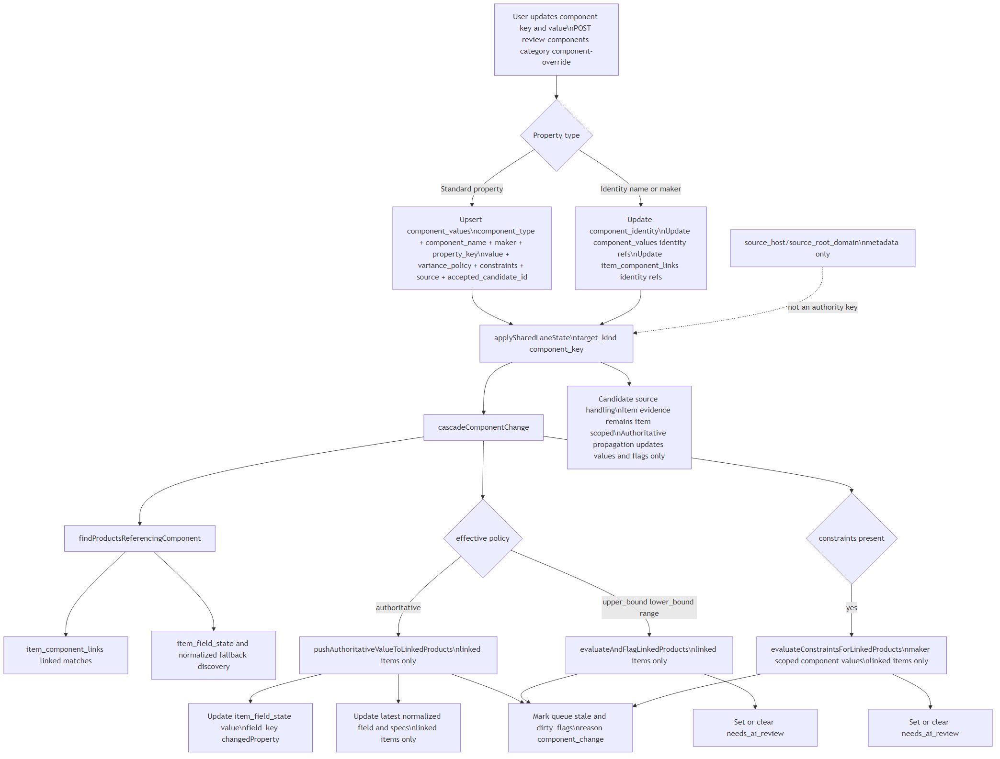
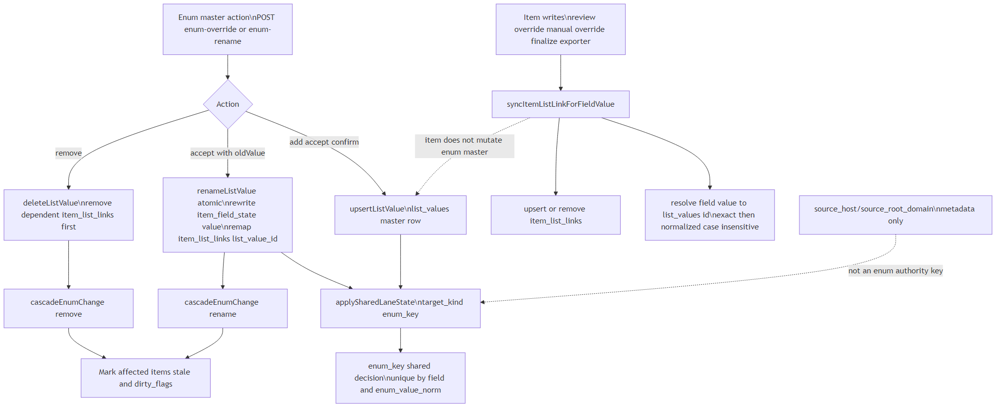
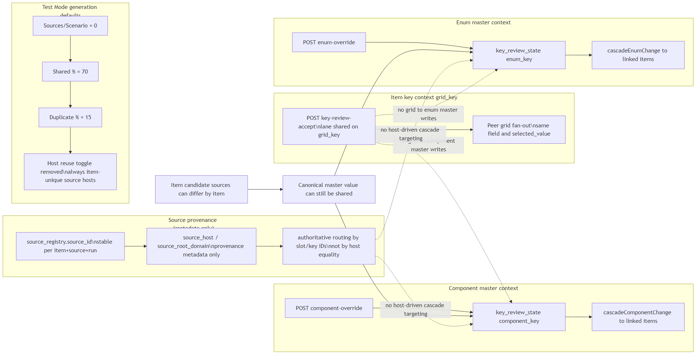
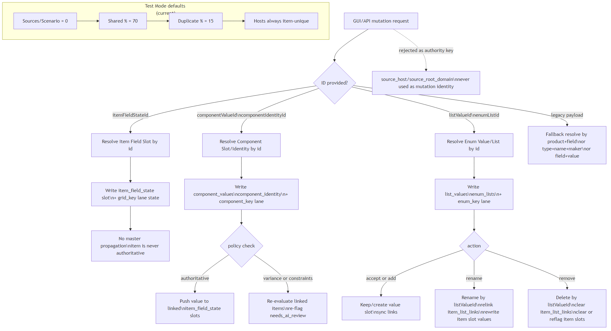
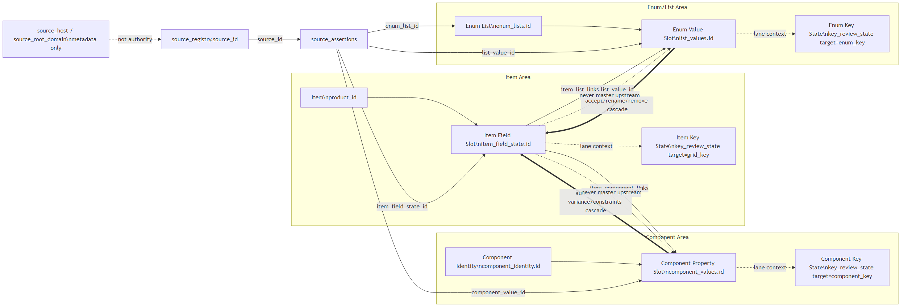

# Component + Enum Authority Mermaid Diagrams

Last verified: 2026-02-19

This folder contains Mermaid source and rendered outputs for item keys, component tables, component keys, enum keys, and enum values.

## What is covered
- Component authoritative propagation to linked items
- Component variance and constraints re-flag flow
- Enum master propagation and item enum link sync
- Lane decoupling (grid key vs component key vs enum key)
- Data hierarchy between item state, links, masters, and review state
- Source provenance identity boundary (`source_host` metadata vs ID-driven authority)
- Test Mode source-generation defaults (`0 / 70 / 15`) with item-unique source hosts

## Files
- `component-authoritative-flow.mmd`
- `enum-master-flow.mmd`
- `lane-decoupling-flow.mmd`
- `entity-hierarchy.mmd`
- `id-first-mutation-resolution-flow.mmd`
- `unified-slot-authority-flow.mmd`
- `*.4k.png` (3840x2160)
- `*.svg`

## Render command
From repo root:

```bash
npm run docs:render:authority-diagrams
```

## 4K Outputs
### Component Authoritative Flow


### Enum Master Flow


### Lane Decoupling


### Entity Hierarchy


### ID-First Mutation Resolution


### Unified Slot Authority


## Logic assertions shown in the diagrams
- Item/grid shared acceptance does not write back into component/enum masters.
- Component and enum master updates propagate downward to linked item keys.
- Authoritative component updates write linked item values directly.
- Variance/constraint component updates re-run flags across linked items.
- Item-level candidate sources can differ while still mapping to shared master values.
- Source host metadata never acts as an authority key for routing/cascade.
